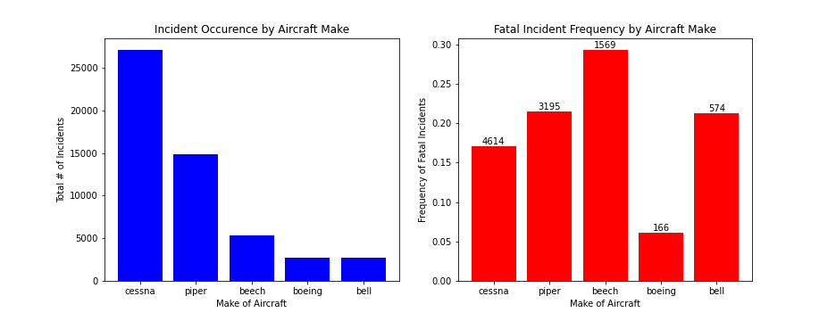
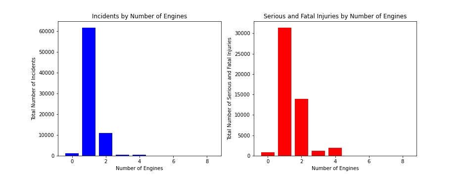
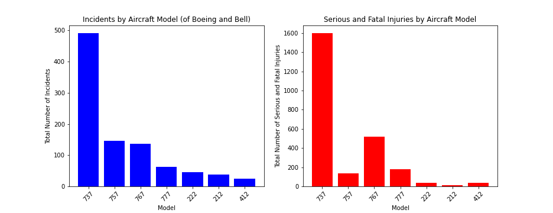
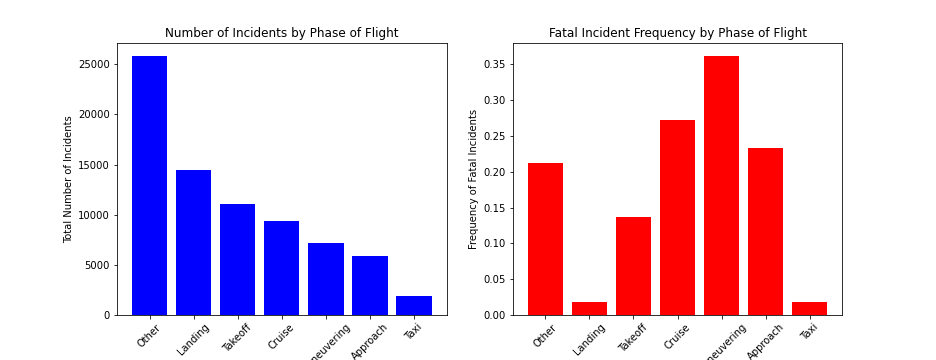
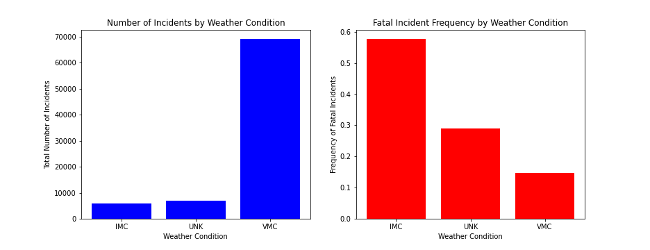
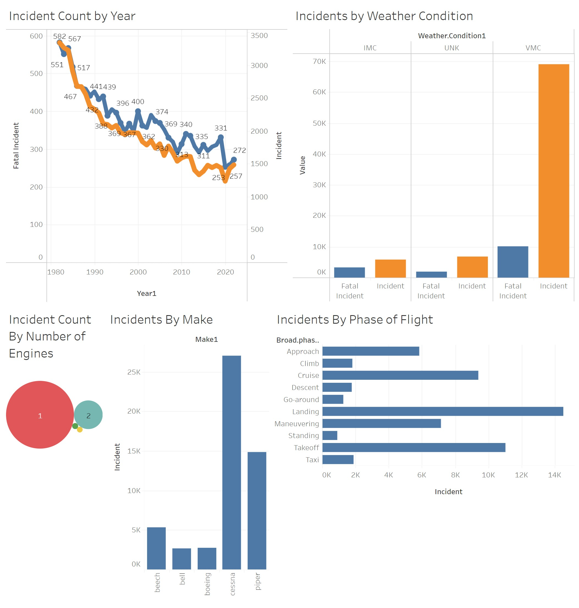

# Aircraft Risk Assessment

**Authors**: Christopher Henry

## Overview

Our client is interested in expanding the business into purchasing and operating airlines for commercial and private enterprise. This project analyses flight data from the National Transportation Safety Board in order to determine which aircraft pose the lowest risk for the company in expanding the business by entering into this new sector.

We analyze this database with Total Incident Count, Frequency of Fatal Incidents,Number of Serious or Fatal Passenger Fatalities as our main metrics of safety. We find that airplanes from Boeing and Bell have relatively few incidents, as do aircraft with 2 engines. Aircraft Models of 757 or 777 type also had relatively few incidents and serious injuries.

## Business Problem

The company wants to limit their exposure risk in entering the airline sector by identifying the safest aircraft to purchase and use in operating flights. To this end, they wish to have a clear understanding of which variables (in aircraft type and details of flight operations) carry the lowest risk.


## Data

For this analysis, we will make use of the National Transportation Safety Board database of [Aviation Accidents](https://www.kaggle.com/datasets/khsamaha/aviation-accident-database-synopses). Each row contains an entry logging an accident/incident of one U.S. flight, including details about the aircraft make and type, accident severity, and flight details and weather conditions.

Our target variables will be the occurence of incidents, frequency of fatal incidents, and serious passenger injuries.

## Methods

The database was imported into pandas for descriptive analysis of basic summary statistics relating to fatalities.

Data were standardized and cleaned to have common entries, and columns were added to track total number of passengers and fatal incidents. These data were then grouped by details of aircraft and flight to generate the relevant summary statistics.

## Main Results

Key results highlight that:
* Boeing and Bell were the common Make of aircraft with few incidents and fatalities.
* 2-engine planes had far fewer incidents than single engine planes.
* 757 and 777 model aircraft had far fewer incidents and fatalities than 737 models.


### Boeing and Bell had relatively few incidents.


### 2-engine planes had far fewer incidents than single-engine planes.


### 757 and 777 aircraft had fewer incidents and fatalities.


### Fatal incidents were most common during maneuvering.


### Incidents occurred most often in visible conditions, but bad visibility led to greater risk of fatality given an incident.


### Example Tableau Dashboard


## Conclusions

These analyses suggest three main recommendations for the company as it enters the commercial and private airline market.

* They should purchase aircraft and from Boeing and Bell, as they have fewer incidents.

* They should initially focus on aircraft with 2 engines, as they have far fewer incidents than single-engine planes.

* They should focus first purchases on 757 and 777 models of aircraft as these have relatively few incidents and serious injuries (especially compared to 737 models).

## For More Information

Please review our full analysis in [our Jupyter Notebook](./aircraft_risk_assessment.ipynb) or our [presentation](./presentation.pdf) or our [Tableau dashboard](https://public.tableau.com/app/profile/christopher.henry7294/viz/aircraft_risk_assessment_workbook/Aviation_Safety_Dashboard?publish=yes).

For any additional questions, please contact.

## Repository Structure

Describe the structure of your repository and its contents, for example:

```
├── README.md                           <- The top-level README for reviewers of this project
├── LICENSE.md                          <- License file 
├── aircraft_risk_assessment.ipynb      <- Narrative documentation of analysis in Jupyter notebook
├── presentation.pdf                    <- PDF version of project presentation
├── data                                <- Both sourced externally and generated from code
└── images                              <- Both sourced externally and generated from code
```
